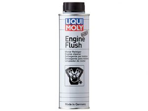

### Descrizione Prodotto:

La confezione di engine flush da 300 ml è concentrata rispetto a quella da 500 ml.
Aggiungere all’olio motore vecchio PRIMA del cambio d’olio. Lasciare girare 10 minuti ai minimi giri il motore con l’olio usato ad auto ferma e cambiare il lubrificante e il filtro.

### La Mia Opinione

il prodotto l’ho testato sulla mia Punto jtd del 99 ,
il prodotto si inserisce nel l’olio del motore da ferma, accendere il motore per 10 minuti e poi si cambia l’olio, quando ho svuotato la coppa dell’olio ho notato la differenza ,nel flusso dell’olio in caduta c’erano piccole masse, evidentemente accumulate negli anni, il prodotto ha agito bene, lo consiglio.

### prezzo 1000.00 EUR

1. amazon
2. ebay
