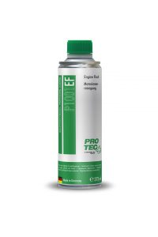

### Descrizione Prodotto:

Prodotto Professionale Made In Germany Pulisce l’intero sistema di lubrificazione da contaminazioni e da incrostazioni, dissolve i residui delle fasce elastiche e dalle teste dei cilindri, neutralizza gli acidi nocivi del motore. Riduzione del consumo del carburante, minori emissioni dei gas di scarico e il catalizzatore ha una durata di vita più lunga. Uso Per tutti i motori benzina e diesel, trasmissioni, differenziali e altri motori ad alte prestazioni (ad esempio generatori, nave e l’area in barca, ecc) Ideale per i veicoli con: • Olio vegetale • RME – olio di colza metilestere • PME – esteri metilici vegetali Modalità Utilizzo Versare il prodotto PRO-TEC prima di ogni cambio olio nella coppa insieme all’olio usato. Far girare il motore al minimo per circa 10/15 min. Dopodiché cambiare l’olio e il filtro in conformità con le istruzioni del produttore. Sufficiente fino a 6 lt di olio. Tempo di azione ca. 15 minuti Consumo 75 ml per ogni litro di olio, 375 ml sono sufficienti per una vettura

### La Mia Opinione

Posso dire che la macchina a benzina ( d epoca ) risponde alquanto meglio!
Lo farò prima di ogni tagliando!
Prodotto eccellente con costi irrisori!

### prezzo 20,00€ Spedizione Gratuita

1. amazon
2. ebay
